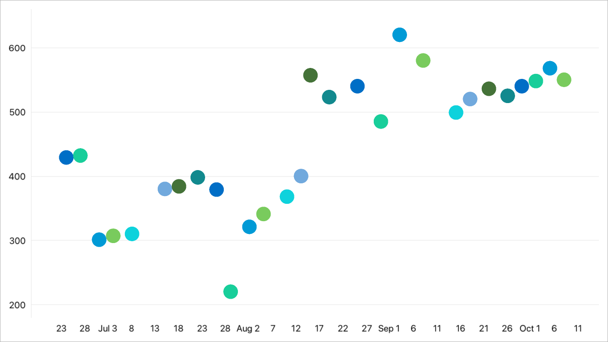

<!-- default file list -->
*Files to look at*:

* [MainPage.xaml](./ColorEachPointColorizerExample/MainPage.xaml)
* [ViewModel.cs](./ColorEachPointColorizerExample/ViewModel.cs)
<!-- default file list end -->
# Predefined Point Colorizer

This example demonstrates how to paint series points with colors from the specified palette. For a complete description, refer to the following help topic: [Colorize Series Points](https://docs.devexpress.com/MobileControls/401980/xamarin-forms/charts/examples/color-series#point-colorizers).

To run the application:
1. [Obtain your NuGet feed URL](http://docs.devexpress.com/GeneralInformation/116042/installation/install-devexpress-controls-using-nuget-packages/obtain-your-nuget-feed-url).
2. Register the DevExpress NuGet feed as a package source.
3. Restore all NuGet packages for the solution.