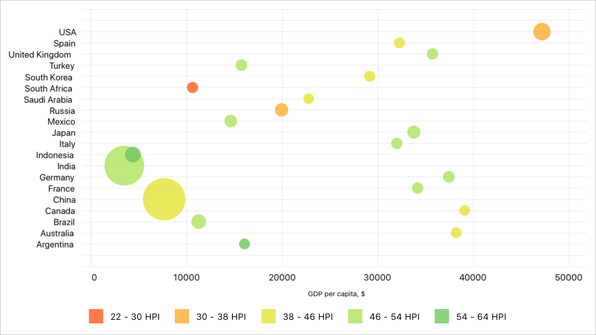

In this example, the bubble chart displays GDP values for the G20. A point's size indicates the country population and the color indicates the [HPI](https://en.wikipedia.org/wiki/Happy_Planet_Index).

