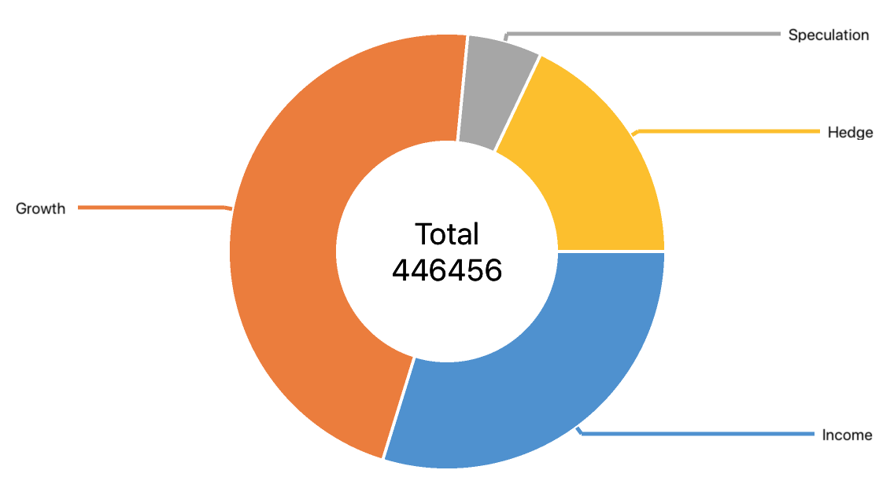

# Xamarin.Forms Pie Center Label Example

This example demonstrates how to show a Text Center Label in a donut series' hole:

### To run the application:

1. [Obtain your NuGet feed URL](http://docs.devexpress.com/GeneralInformation/116042/installation/install-devexpress-controls-using-nuget-packages/obtain-your-nuget-feed-url).
2. Register the DevExpress NuGet feed as a package source.
3. Restore all NuGet packages for the solution.