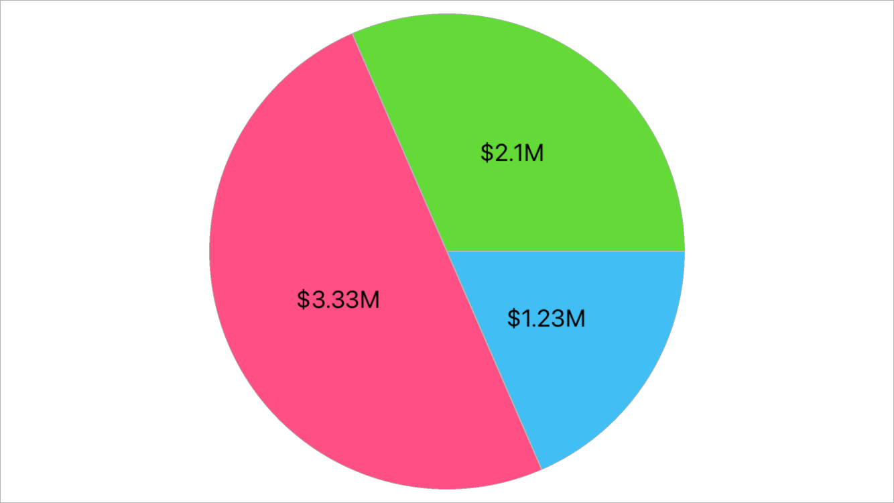

<!-- default file list -->
*Files to look at*:

* [MainPage.xaml](./SeriesLabelTextProviderExample/MainPage.xaml)
* [MainPage.xaml.cs](./SeriesLabelTextProviderExample/MainPage.xaml.cs)

<!-- default file list end -->
# Generate Custom Text for Series Labels

This example shows how to configure the pie series so that its labels display point values as *thousands*, *millions* or *billions of dollars* in the following way:
- *1234* -> *$1.234K* 
- *123456789* -> *$123.457M*
- *12345678901* -> *$12.346B*

1. Create a class (*LabelTextProvider*) that implements the [ISeriesLabelTextProvider](https://docs.devexpress.com/MobileControls/DevExpress.XamarinForms.Charts.ISeriesLabelTextProvider) interface.
2. Implement the [GetText](https://docs.devexpress.com/MobileControls/DevExpress.XamarinForms.Charts.ISeriesLabelTextProvider.GetText(DevExpress.XamarinForms.Charts.SeriesLabelValuesBase)) method that returns a string for each label instance. A [PieSeriesLabelValues](https://docs.devexpress.com/MobileControls/DevExpress.XamarinForms.Charts.PieSeriesLabelValues) object is an argument of this method when it is called for a pie series. Use the [PieSeriesLabelValues.Value](https://docs.devexpress.com/MobileControls/DevExpress.XamarinForms.Charts.PieSeriesLabelValues.Value) property to access series point values.
3. Assign a *LabelTextProvider* object to the [PieSeriesLabel.TextProvider](https://docs.devexpress.com/MobileControls/DevExpress.XamarinForms.Charts.SeriesLabel.TextProvider) property.

To run the application:
1. [Obtain your NuGet feed URL](http://docs.devexpress.com/GeneralInformation/116042/installation/install-devexpress-controls-using-nuget-packages/obtain-your-nuget-feed-url).
2. Register the DevExpress NuGet feed as a package source.
3. Restore all NuGet packages for the solution.