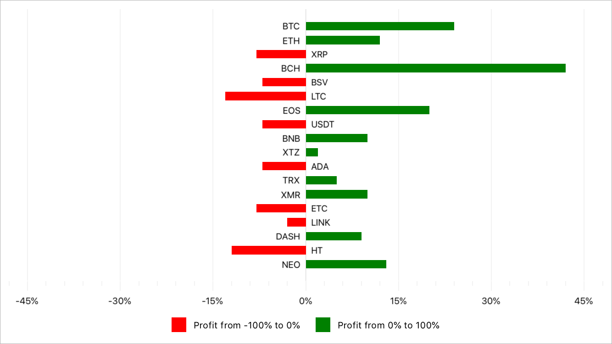

<!-- default file list -->
*Files to look at*:

* [MainPage.xaml](./ValueRangeColorizerExample/MainPage.xaml)
* [ViewModel.cs](./ValueRangeColorizerExample/ViewModel.cs)
<!-- default file list end -->
# Predefined Value Range Colorizer

In this example, the bar chart displays cryptocurrency portfolio yield. It colors series points red when their Y-axis values are between **-100** and **0**, and green when values are between **0** and **100**. Note that this chart diagram is rotated. For a complete description, refer to the following help topic: [Colorize Series Points](https://docs.devexpress.com/MobileControls/401980/xamarin-forms/charts/examples/color-series#predefined-value-range-colorizers).

To run the application:
1. [Obtain your NuGet feed URL](http://docs.devexpress.com/GeneralInformation/116042/installation/install-devexpress-controls-using-nuget-packages/obtain-your-nuget-feed-url).
2. Register the DevExpress NuGet feed as a package source.
3. Restore all NuGet packages for the solution.